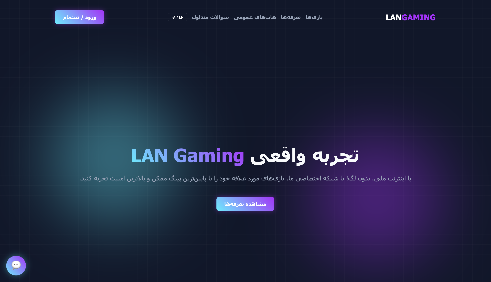

# 🎮 LAN GAMING | نهایت تجربه گیمینگ

**🌐 آدرس وب‌سایت ما: [langaming.top](http://langaming.top)**

---

### 👾 بازی LAN یعنی چی؟
یعنی چند نفر داخل یک شبکه مشترک با هم بازی می‌کنن؛ مثل وقتی که توی گیم‌نت کنار هم می‌شینید.

### ❔ ما چی کار می‌کنیم؟
ما یک شبکه LAN مجازی می‌سازیم تا شما و دوستات حتی اگه توی شهرهای مختلف باشید، انگار توی یک شبکه محلی کنار هم هستید.

### ❔ چه بازی هایی این قابلیت رو دارن؟
وارد منوی بازی مورد نظر خود شوید و بررسی کنید که آیا گزینه‌ای به نام **LAN**، **Local Network**، **LAN Party**، **System Link** یا **Offline Multiplayer** وجود دارد یا خیر. سرویس ما فقط و فقط بازی‌هایی را به هم متصل می‌کند که دارای این قابلیت در منوی خود باشند.

### 🎮 نتیجه؟
- 🚀 **پینگ خیلی کم**
- 🛸 **بازی روان‌تر**
- 🌏 **بدون سرور خارجی**
- 🛡️ **بدون لگ و قطع شدن**

---

## 🚀 سایر ویژگی‌های کلیدی
- **بازی با اینترنت ملی:** بدون نیاز به اینترنت بین‌الملل و مصرف ترافیک خارجی.
- **دور زدن تحریم‌های گیمینگ:** نیازی به اتصال به سرورهای خارجی و دردسرهای تحریم نیست.
- **پشتیبانی کراس‌پلتفرم:** قابل استفاده در ویندوز، اندروید و iOS.
- **هاب‌های عمومی رایگان:** امکان ورود به سرورهای عمومی برای پیدا کردن حریف و هم‌تیمی.
- **اکانت‌های اشتراکی:** امکان اشتراک‌گذاری یک اکانت با دوستان (در پلن‌های استاندارد و VIP).

---

## 🛠️ تکنولوژی‌های فرانت‌اند
این ریپازیتوری شامل سورس‌کدهای رابط کاربری (Front-End) است:
- **HTML5**
- **CSS3** ( Glassmorphism طراحی ریسپانسیو و استایل )
- **Vanilla JavaScript** (مدیریت مودال‌ها، تب‌ها و اتصال‌ها)

---

## ⚙️ توضیحات فنی و مهندسی (زیرساخت شبکه)
برای گیمرهایی که می‌خواهند بدانند سیستم ما دقیقاً چگونه کار می‌کند:

ما از نرم‌افزار قدرتمند **SoftEther VPN** برای ایجاد هاب‌های مجازی (Virtual Hubs) استفاده می‌کنیم. تفاوت اصلی سرویس ما با VPN های معمولی در **لایه اتصال شبکه** است:
- **شبیه‌سازی لایه ۲ شبکه (Layer 2 - Data Link):** برخلاف تونل‌های معمولی که در لایه ۳ (IP) کار می‌کنند، سیستم ما فریم‌های اترنت (Ethernet Frames) را مستقیماً کپسوله کرده و از طریق اینترنت منتقل می‌کند.
- **پشتیبانی از Broadcast و Multicast:** بازی‌های شبکه (LAN) برای پیدا کردن سرور همدیگر پیام‌های Broadcast (آدرس `255.255.255.255`) ارسال می‌کنند. از آنجا که سیستم ما لایه ۲ را شبیه‌سازی می‌کند، این پیام‌ها به درستی بین کامپیوترهای شما منتقل می‌شوند؛ دقیقاً مثل اینکه همگی به یک سوییچ فیزیکی (Switch) متصل باشید.
- **پینگ پایدار:** با استفاده از سرورهای اختصاصی داخل کشور و دور زدن مسیریابی‌های پیچیده لایه ۳، تاخیر (Delay) و Jitter به حداقل ممکن می‌رسد.

---

## 📞 راه‌های ارتباطی و پشتیبانی

برای پشتیبانی و اخبار به شبکه‌های اجتماعی ما در پیام‌رسان **بله** بپیوندید:

- 📣 **کانال ما:** [@langaming](https://ble.ir/langaming)
- 🎧 **پشتیبانی:** [@lan_gaming](https://ble.ir/lan_gaming)
- 💬 **گروه (گپ):** [@lan_gaming_gap](https://ble.ir/lan_gaming_gap)
- بلافاصله بعد از اتصال اینترنت بین الملل آدرس های تلگرام جایگزین خواهد شد.

---
## 📸 اسکرین‌شات‌های محیط کاربری

---
*ساخته شده با 💜 برای گیمرهای ایرانی*
